<div align="center">


<p> A Mobile Application for Filipino Sign Language Interpretation Using Real-Time Gesture Recognition to Aid in Deaf Communication</p>

<p>
<table>
  <tr>
    <td align="center">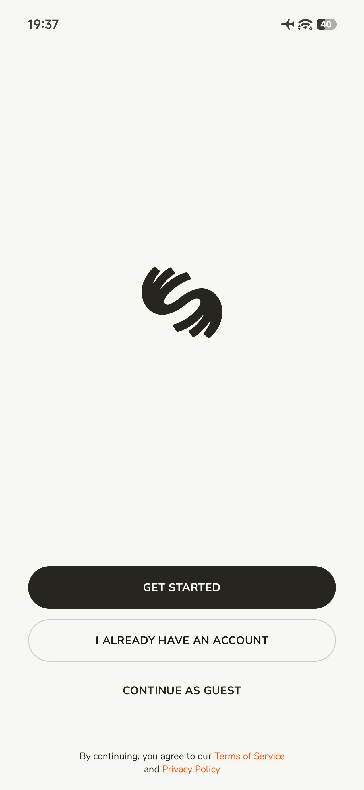<br><sub>Get Started</sub></td>
    <td align="center">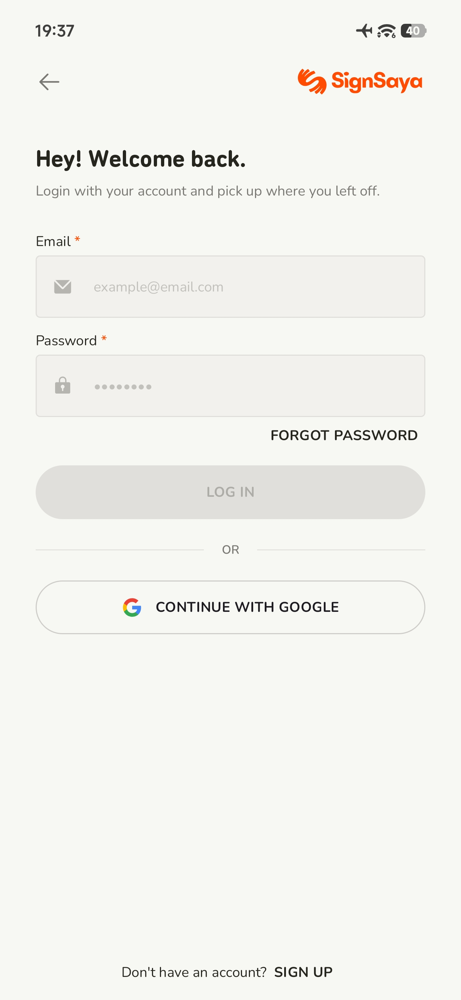<br><sub>Login</sub></td>
    <td align="center">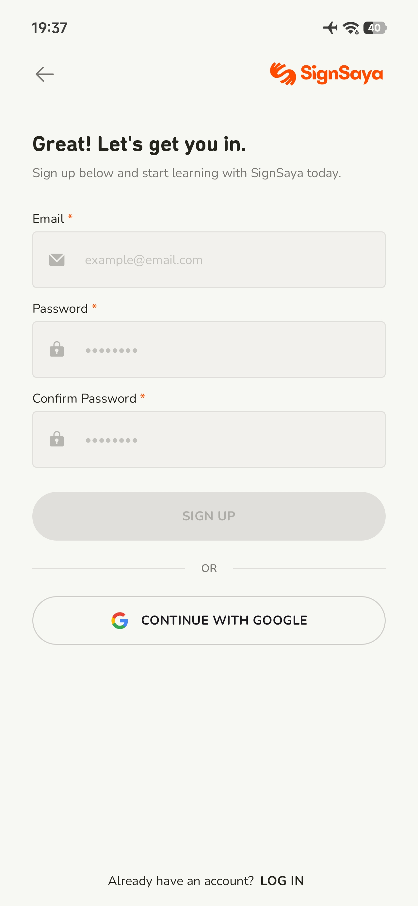<br><sub>Sign Up</sub></td>
    <td align="center">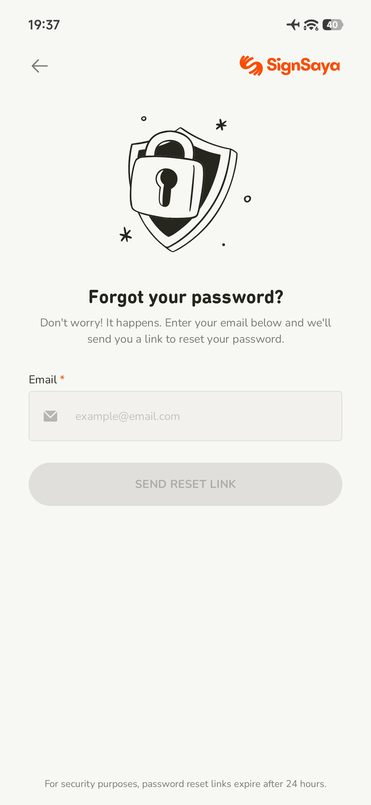<br><sub>Forgot Password</sub></td>
  </tr>
  <tr>
    <td align="center">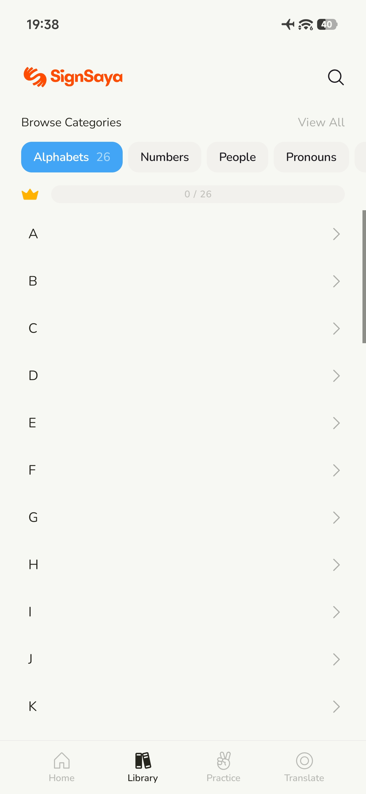<br><sub>Library</sub></td>
    <td align="center">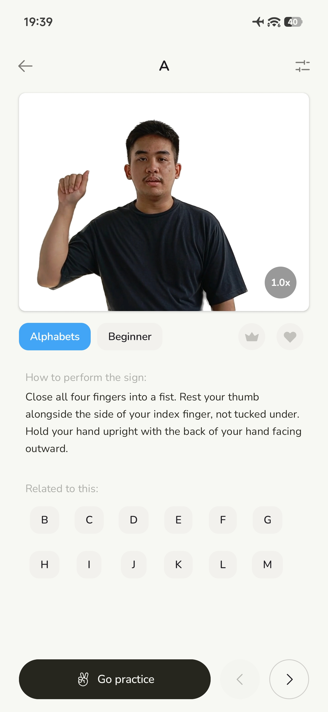<br><sub>Dictionary</sub></td>
    <td align="center">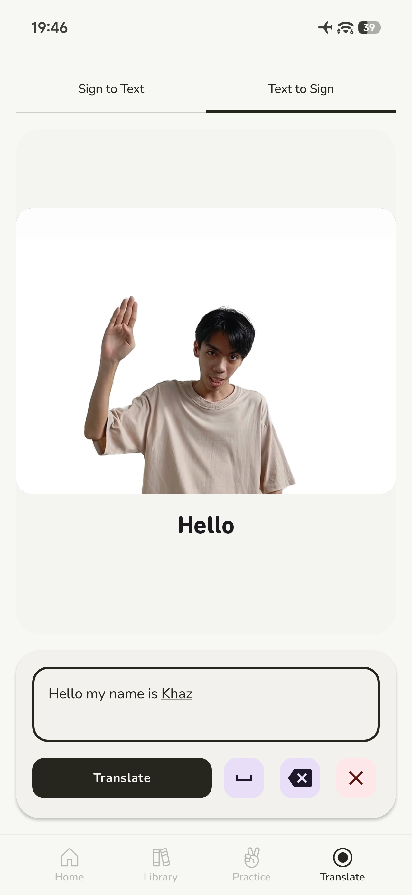<br><sub>Text to Sign</sub></td>
    <td align="center">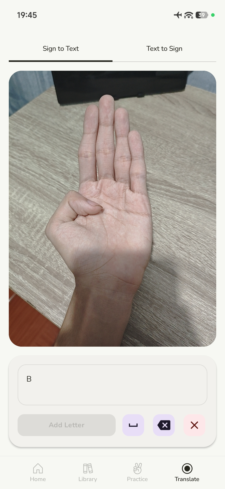<br><sub>Sign to Text</sub></td>
  </tr>
  <tr>
    <td align="center">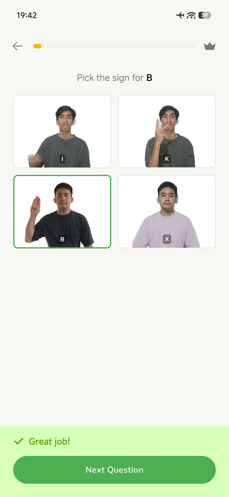<br><sub>Quiz</sub></td>
    <td align="center">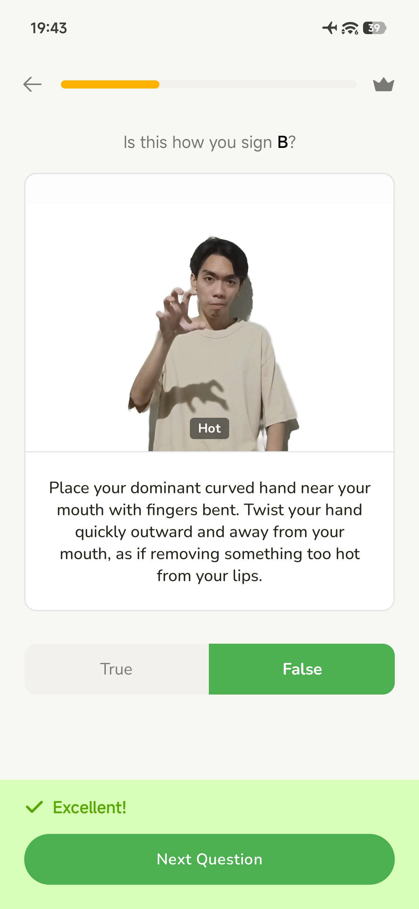<br><sub>Quiz Result</sub></td>
    <td align="center">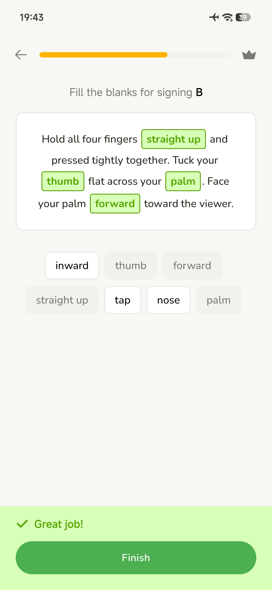<br><sub>Quiz Review</sub></td>
    <td align="center">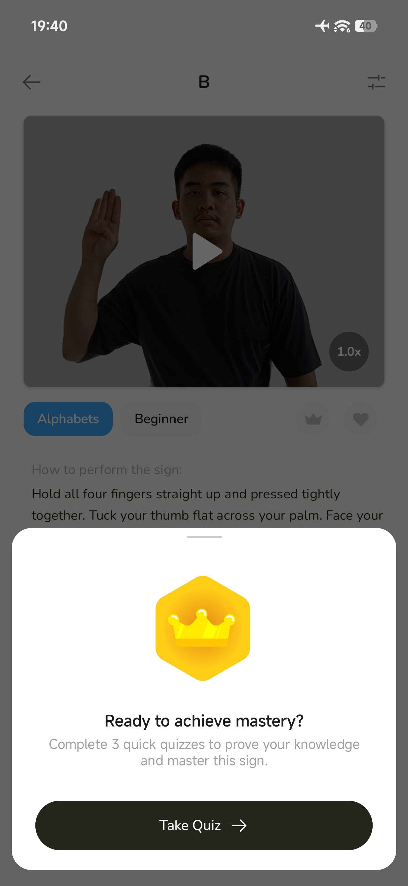<br><sub>Mastery</sub></td>
  </tr>
</table>
</p>

</div>

<p align="center">
  
  
  
  
</p>

## Features

<table>
<tr>
<td width="50%" valign="top">

### Learn

- Interactive Filipino Sign Language lessons.
- Category-based vocabulary and topics.
- Video demonstrations for every sign.
- Searchable FSL dictionary.

</td>
<td width="50%" valign="top">

### Translate

- Real-time **FSL → Text** translation.
- **Text → FSL** visual interpretation.
- Camera-based hand gesture recognition.
- TensorFlow Lite powered on-device inference.

</td>
</tr>

<tr>
<td width="50%" valign="top">

### Practice

- Interactive quizzes and exercises.
- Progress tracking across lessons.
- Instant answer feedback.

</td>
<td width="50%" valign="top">

### Experience

- Google Sign-In and Guest Mode.
- Cloud sync with Firebase.
- Material 3 user interface.
- Responsive Jetpack Compose design.

</td>
</tr>
</table>

## Project Structure & Tech Stack

```text
SignSaya
│
├── app
│   ├── screens        UI screens
│   ├── components     Reusable Compose components
│   ├── navigation     Navigation graph
│   ├── viewmodel      State management
│   ├── models         Data models
│   ├── firebase       Authentication & Firestore services
│   ├── utils          Shared utilities
│   └── assets         ML models and application resources
│
└── assets             README images and media
```

| **Layer** | **Technology** |
| :-- | :-- |
| **Frontend** | Kotlin, Jetpack Compose, Material 3, Lottie |
| **Backend** | Firebase Authentication, Cloud Firestore, Firebase Storage |
| **Computer Vision** | MediaPipe Hands, OpenCV |
| **Machine Learning** | TensorFlow Lite |
| **Design** | Figma |

## Installation

Clone the repository and open it in Android Studio.

```bash
git clone https://github.com/Leewenctt/SignSaya.git
cd SignSaya
```

Add your Firebase configuration file:

```text
app/google-services.json
```

Sync Gradle and run the project on an Android device or emulator.

### Requirements

- Android Studio (Hedgehog or newer)
- Android SDK 24+
- Firebase project with Authentication and Firestore enabled
